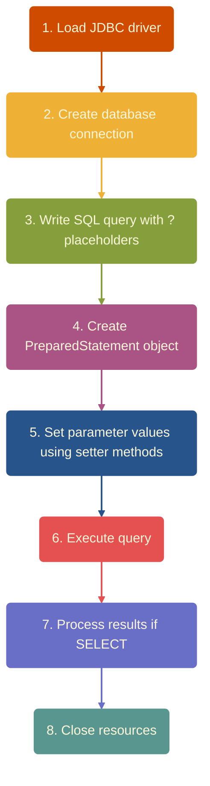

# 🧾 PreparedStatement – Complete Explanation
---

## ✅ 1. Definition

A **PreparedStatement** in Java is a precompiled SQL statement that allows you to execute the same query multiple times with different values. It uses **placeholders (`?`)** to safely insert values, making it faster and more secure than `Statement`.

### 🔑 Key Points:
- Part of `java.sql` package
- Extends `Statement` interface
- Precompiled at database level
- Parameterized queries using `?`
- Prevents SQL injection attacks

### 📝 Syntax:
```java
PreparedStatement ps = connection.prepareStatement(sqlQuery);
```

---

# 🍕 2. Real-World Analogy

### 🧠 Analogy 1: Pizza Order Template

A pizza shop gives you a **pre-designed form**:
```
Pizza Type: ______
Size: ______
Quantity: ______
Toppings: ______
```

You fill only the blanks each time you order.

### 🟢 Relation to PreparedStatement

| Pizza Form | PreparedStatement |
|------------|-------------------|
| Template = | SQL query with `?` |
| Filling blanks = | `ps.setString()`, `ps.setInt()` |
| Faster ordering = | SQL precompiled |
| No mistakes = | Input safely handled |
| No hacking = | Prevents SQL injection |

---

### 🧠 Analogy 2: Coffee Shop Order

Imagine a coffee machine with buttons:
- **Button 1**: Coffee Type (Espresso/Latte/Cappuccino)
- **Button 2**: Size (Small/Medium/Large)
- **Button 3**: Sugar Level (0/1/2/3)

The machine (PreparedStatement) knows the recipe. You just select options (parameters).

---

# ⭐ 3. Features of PreparedStatement

| Feature | Description | Example |
|---------|-------------|---------|
| **Parameterized Query** | Uses `?` placeholders | `SELECT * FROM users WHERE id=?` |
| **Precompiled** | SQL compiled once and reused | Performance boost |
| **Prevents SQL Injection** | Safe handling of user input | No malicious SQL execution |
| **Type Safe** | Uses methods like `setInt()`, `setString()` | Compile-time checking |
| **Faster Execution** | Ideal for repeated or batch queries | 50-70% faster |
| **Cleaner Code** | Removes messy string concatenation | Readable code |
| **Supports Batch** | Add multiple sets of values and execute | Bulk operations |
| **Database Independent** | Works across MySQL, Oracle, PostgreSQL | Portable code |

---

# 🎯 4. Benefits

### 🔒 1. Prevents SQL Injection
User input is sent safely without mixing into SQL commands.

**Statement ❌ :**
```java
String query = "SELECT * FROM users WHERE name='" + userInput + "'";
// userInput = "admin' OR '1'='1" → SQL Injection!
```

**PreparedStatement ✅:**
```java
String query = "SELECT * FROM users WHERE name=?";
ps.setString(1, userInput); // Safe, treated as data only
```

### ⚡ 2. Faster Execution
Query is compiled only once → improves performance by 50-70%.

**Scenario:** Execute same query 1000 times
- **Statement:** Compile 1000 times ❌
- **PreparedStatement:** Compile once, execute 1000 times ✅

### 💡 3. Reduces Syntax Errors
No manual quotes or string concatenation.

**Statement (Error-prone):**
```java
String sql = "INSERT INTO users VALUES('" + name + "', " + age + ")";
// What if name contains apostrophe? → Error!
```

**PreparedStatement (Safe):**
```java
String sql = "INSERT INTO users VALUES(?, ?)";
ps.setString(1, name);
ps.setInt(2, age);
```

### 🧹 4. Clean & Maintainable
Query stays readable and clear.

### 🛡 5. Type Safety
Values must match data type → compile-time checking.

### 🔄 6. Reusability
Same query can be executed multiple times with different values.

### 📦 7. Batch Operations Support
Execute multiple queries efficiently in one go.

---

# 🛠 5. How to Use PreparedStatement

## 📋 Complete Steps:

### **Step 1: Load JDBC Driver**
```java
Class.forName("com.mysql.cj.jdbc.Driver");
```

### **Step 2: Create Connection**
```java
Connection con = DriverManager.getConnection(
        "jdbc:mysql://localhost:3306/mydb",
        "root",
        "password"
);
```

### **Step 3: Write SQL with '?'**
```java
String sql = "INSERT INTO staff (name, email, phone, salary) VALUES (?, ?, ?, ?)";
```

### **Step 4: Create PreparedStatement**
```java
PreparedStatement ps = con.prepareStatement(sql);
```

### **Step 5: Set Values (Parameter Index starts from 1)**
```java
ps.setString(1, "Amit Kumar");
ps.setString(2, "amit@gmail.com");
ps.setLong(3, 9876543210L);
ps.setDouble(4, 45000.50);
```

### **Step 6: Execute Query**
```java
int rows = ps.executeUpdate(); // For INSERT/UPDATE/DELETE
// OR
ResultSet rs = ps.executeQuery(); // For SELECT
```

### **Step 7: Process Results (if SELECT)**
```java
while(rs.next()) {
        System.out.println(rs.getString("name"));
        }
```

### **Step 8: Close Resources**
```java
rs.close();
ps.close();
con.close();
```

---

# 📌 6. Full Examples

## 🔵 Example 1: INSERT Operation
```java
import java.sql.*;

public class InsertExample {
    public static void main(String[] args) {
        try {
            // 1. Load Driver
            Class.forName("com.mysql.cj.jdbc.Driver");

            // 2. Create Connection
            Connection con = DriverManager.getConnection(
                    "jdbc:mysql://localhost:3306/schooldb",
                    "root",
                    "admin123"
            );

            // 3. SQL Query with placeholders
            String sql = "INSERT INTO students (name, age, marks) VALUES (?, ?, ?)";

            // 4. Create PreparedStatement
            PreparedStatement ps = con.prepareStatement(sql);

            // 5. Set values
            ps.setString(1, "Rahul Sharma");
            ps.setInt(2, 21);
            ps.setDouble(3, 85.5);

            // 6. Execute
            int rows = ps.executeUpdate();

            // 7. Check result
            if (rows > 0) {
                System.out.println("✅ Student inserted successfully!");
            }

            // 8. Close
            ps.close();
            con.close();

        } catch (Exception e) {
            e.printStackTrace();
        }
    }
}
```

---

## 🟢 Example 2: UPDATE Operation
```java
String query = "UPDATE techstaff SET tsSalary=?, tsDesignation=? WHERE tid=?";
PreparedStatement ps = con.prepareStatement(query);

// Set new values
ps.setDouble(1, 55000.75);
ps.setString(2, "Senior Developer");
ps.setInt(3, 101);

// Execute update
int row = ps.executeUpdate();

if (row > 0) {
        System.out.println("✅ Salary and designation updated!");
} else {
        System.out.println("❌ No record found with given ID");
}

        ps.close();
```

---

## 🟡 Example 3: DELETE Operation
```java
String sql = "DELETE FROM employees WHERE emp_id=?";
PreparedStatement ps = con.prepareStatement(sql);

ps.setInt(1, 205);

int result = ps.executeUpdate();

if (result > 0) {
        System.out.println("✅ Employee deleted successfully!");
}

        ps.close();
```

---

## 🔴 Example 4: SELECT Operation
```java
String query = "SELECT * FROM users WHERE city=? AND age>=?";
PreparedStatement ps = con.prepareStatement(query);

ps.setString(1, "Mumbai");
ps.setInt(2, 25);

ResultSet rs = ps.executeQuery();

System.out.println("📋 Users from Mumbai aged 25+:");
System.out.println("--------------------------------");

while (rs.next()) {
int id = rs.getInt("user_id");
String name = rs.getString("name");
int age = rs.getInt("age");
String city = rs.getString("city");
    
    System.out.println("ID: " + id + " | Name: " + name +
        " | Age: " + age + " | City: " + city);
}

        rs.close();
ps.close();
```

---

## 🟣 Example 5: Multiple Executions
```java
String sql = "INSERT INTO products (name, price) VALUES (?, ?)";
PreparedStatement ps = con.prepareStatement(sql);

// Insert Product 1
ps.setString(1, "Laptop");
ps.setDouble(2, 45000);
ps.executeUpdate();

// Insert Product 2 (reuse same PreparedStatement)
ps.setString(1, "Mouse");
ps.setDouble(2, 500);
ps.executeUpdate();

// Insert Product 3
ps.setString(1, "Keyboard");
ps.setDouble(2, 1200);
ps.executeUpdate();

System.out.println("✅ 3 products inserted!");

ps.close();
```

---

# 🔧 7. Important Methods

## 📌 Setting Parameter Values:

| Method | Description | Example |
|--------|-------------|---------|
| `setInt(index, value)` | Set integer value | `ps.setInt(1, 25)` |
| `setString(index, value)` | Set string value | `ps.setString(1, "John")` |
| `setDouble(index, value)` | Set double value | `ps.setDouble(1, 45.67)` |
| `setFloat(index, value)` | Set float value | `ps.setFloat(1, 23.4f)` |
| `setLong(index, value)` | Set long value | `ps.setLong(1, 9876543210L)` |
| `setBoolean(index, value)` | Set boolean value | `ps.setBoolean(1, true)` |
| `setDate(index, value)` | Set date value | `ps.setDate(1, new Date(...))` |
| `setNull(index, sqlType)` | Set NULL value | `ps.setNull(1, Types.INTEGER)` |
| `setBytes(index, value)` | Set byte array | `ps.setBytes(1, byteArray)` |
| `setObject(index, value)` | Set any object | `ps.setObject(1, obj)` |

---

## 📌 Execution Methods:

| Method | Return Type | Used For | Example |
|--------|-------------|----------|---------|
| `executeUpdate()` | `int` | INSERT, UPDATE, DELETE | `int rows = ps.executeUpdate()` |
| `executeQuery()` | `ResultSet` | SELECT queries | `ResultSet rs = ps.executeQuery()` |
| `execute()` | `boolean` | Any SQL (returns true if ResultSet) | `boolean hasResults = ps.execute()` |
| `executeBatch()` | `int[]` | Batch operations | `int[] results = ps.executeBatch()` |

---

## 📌 Batch Methods:

| Method | Description |
|--------|-------------|
| `addBatch()` | Add current set of parameters to batch |
| `executeBatch()` | Execute all batched statements |
| `clearBatch()` | Clear all batched statements |

---

## 📌 Other Useful Methods:

| Method | Description |
|--------|-------------|
| `clearParameters()` | Clear all parameter values |
| `getMetaData()` | Get metadata about result columns |
| `getParameterMetaData()` | Get metadata about parameters |
| `setFetchSize(int)` | Set number of rows to fetch at once |
| `close()` | Close the PreparedStatement |

---

# ⚖️ 8. Statement vs PreparedStatement {#statement-vs-preparedstatement}

| Feature | Statement | PreparedStatement |
|---------|-----------|-------------------|
| **SQL Structure** | Hardcoded SQL | Parameterized with `?` |
| **Compilation** | Every time | Once (precompiled) |
| **Performance** | Slower | Faster (50-70% boost) |
| **SQL Injection** | ❌ Vulnerable | ✅ Safe |
| **Reusability** | ❌ No | ✅ Yes |
| **Batch Operations** | ❌ Not efficient | ✅ Efficient |
| **Type Safety** | ❌ No | ✅ Yes |
| **Code Readability** | ❌ Poor (concatenation) | ✅ Clean |
| **Use Case** | Static queries (DDL) | Dynamic queries (DML) |
| **Example** | `CREATE TABLE`, `DROP TABLE` | `INSERT`, `UPDATE`, `SELECT` |

---

## 💡 Code Comparison:

### ❌ Using Statement (Bad Practice):
```java
Statement stmt = con.createStatement();

String name = "John";
int age = 25;

// Vulnerable to SQL injection
String sql = "INSERT INTO users VALUES('" + name + "', " + age + ")";
stmt.executeUpdate(sql);

// Every execution = New compilation
```

### ✅ Using PreparedStatement (Best Practice):
```java
String sql = "INSERT INTO users VALUES(?, ?)";
PreparedStatement ps = con.prepareStatement(sql);

// Safe from SQL injection
ps.setString(1, "John");
ps.setInt(2, 25);

ps.executeUpdate(); // Compiled once, reusable
```

---

# 🛡️ 9. SQL Injection Prevention {#sql-injection-prevention}

## ⚠️ What is SQL Injection?

SQL Injection is a code injection technique where an attacker inserts malicious SQL code into an application's input fields to manipulate the database.

---

## 🔴 Example of Vulnerable Code:
```java
// ❌ DANGEROUS CODE - DON'T USE
String username = request.getParameter("username");
String password = request.getParameter("password");

String query = "SELECT * FROM users WHERE username='" + username +
        "' AND password='" + password + "'";

Statement stmt = con.createStatement();
ResultSet rs = stmt.executeQuery(query);
```

### 🔪 Attack Scenario:

**Attacker enters:**
- Username: `admin' --`
- Password: `anything`

**Resulting SQL:**
```sql
SELECT * FROM users WHERE username='admin' --' AND password='anything'
```

The `--` comments out the password check → Attacker logs in as admin!

---

## ✅ Secure Code with PreparedStatement:
```java
// ✅ SAFE CODE
String query = "SELECT * FROM users WHERE username=? AND password=?";
PreparedStatement ps = con.prepareStatement(query);

ps.setString(1, username);
ps.setString(2, password);

ResultSet rs = ps.executeQuery();
```

**Why it's safe:**
- Input is treated as **data**, not **code**
- Special characters are automatically escaped
- No SQL command execution from user input

---

## 🔒 More Attack Prevention Examples:

### Attack Type 1: Delete All Records

**Malicious Input:** `105 OR 1=1`

❌ **Vulnerable (Statement):**
```java
String id = "105 OR 1=1";
String query = "DELETE FROM users WHERE id=" + id;
stmt.executeUpdate(query);
// Result: DELETE FROM users WHERE id=105 OR 1=1
// ALL RECORDS DELETED! 💀
```

✅ **Safe (PreparedStatement):**
```java
ps.setString(1, "105 OR 1=1");
// Treated as literal string "105 OR 1=1", not a condition
// Only looks for id matching that exact string (no match)
```

---

### Attack Type 2: Data Theft

**Malicious Input:** `' UNION SELECT username, password FROM admin_users --`

❌ **Vulnerable:**
```java
String search = "' UNION SELECT username, password FROM admin_users --";
String query = "SELECT * FROM products WHERE name='" + search + "'";
// Exposes admin credentials!
```

✅ **Safe:**
```java
ps.setString(1, search);
// Treats entire string as search term, no UNION execution
```

---

# 📦 10. Batch Processing

## 🎯 What is Batch Processing?

Executing multiple SQL statements together in a single database round-trip for better performance.

---

## ✅ Batch Insert Example:
```java
String sql = "INSERT INTO employees (name, salary, dept) VALUES (?, ?, ?)";
PreparedStatement ps = con.prepareStatement(sql);

// Disable auto-commit for better performance
con.setAutoCommit(false);

// Add 1000 employees
for (int i = 1; i <= 1000; i++) {
        ps.setString(1, "Employee" + i);
    ps.setDouble(2, 30000 + (i * 100));
        ps.setString(3, "Department" + (i % 10));

        // Add to batch
        ps.addBatch();

// Execute in chunks of 100
    if (i % 100 == 0) {
        ps.executeBatch();
        ps.clearBatch();
    }
            }

// Execute remaining
            ps.executeBatch();

// Commit transaction
con.commit();
con.setAutoCommit(true);

System.out.println("✅ 1000 employees inserted via batch!");

ps.close();
```

---

## 🔥 Performance Comparison:

| Method | Time for 1000 Inserts |
|--------|----------------------|
| Individual Execute | ~15 seconds ❌ |
| Batch Execute | ~2 seconds ✅ |

**Performance Gain: 7.5x faster!**

---

## 🟢 Batch Update Example:
```java
String sql = "UPDATE products SET price=price*1.10 WHERE category=?";
PreparedStatement ps = con.prepareStatement(sql);

String[] categories = {"Electronics", "Clothing", "Books", "Toys"};

for (String category : categories) {
        ps.setString(1, category);
    ps.addBatch();
}

int[] results = ps.executeBatch();

System.out.println("✅ Updated " + results.length + " categories");

ps.close();
```

---

# ✨ 11. Best Practices

## ✅ DO's:

1. **Always use PreparedStatement for user input**
```java
   // ✅ Good
String sql = "SELECT * FROM users WHERE email=?";
   ps.setString(1, userEmail);
```

2. **Close resources in finally block or use try-with-resources**
```java
   // ✅ Best approach
   try (Connection con = DriverManager.getConnection(url, user, pass);
PreparedStatement ps = con.prepareStatement(sql)) {

        // Your code here

        } // Auto-closed
```

3. **Use appropriate setter methods**
```java
   ps.setInt(1, age);        // ✅ For integers
   ps.setString(2, name);    // ✅ For strings
   ps.setDouble(3, salary);  // ✅ For decimals
```

4. **Use batch for multiple operations**
```java
   for (int i = 0; i < 100; i++) {
        ps.setString(1, "Name" + i);
       ps.addBatch();
   }
           ps.executeBatch();
```

5. **Handle exceptions properly**
```java
   try {
        // Database code
        } catch (SQLException e) {
        e.printStackTrace();
// Log error, rollback if needed
   }
```

6. **Use connection pooling for production**
```java
   // Use HikariCP, Apache DBCP, or C3P0
```

7. **Set fetch size for large result sets**
```java
   ps.setFetchSize(100); // Fetch 100 rows at a time
```

---

## ❌ DON'Ts:

1. **Don't concatenate SQL strings**
```java
   // ❌ Bad
String sql = "SELECT * FROM users WHERE id=" + userId;
```

2. **Don't ignore closing resources**
```java
   // ❌ Bad - Memory leak
PreparedStatement ps = con.prepareStatement(sql);
   ps.executeUpdate();
// Forgot to close!
```

3. **Don't reuse PreparedStatement for different queries**
```java
   // ❌ Bad
PreparedStatement ps = con.prepareStatement("SELECT * FROM users");
// Later trying to use same ps for INSERT
```

4. **Don't mix Statement and PreparedStatement**
```java
   // ❌ Inconsistent
Statement stmt = con.createStatement();
PreparedStatement ps = con.prepareStatement(sql);
```

5. **Don't forget parameter index starts from 1**
```java
   // ❌ Wrong
   ps.setString(0, name); // No index 0!

// ✅ Correct
   ps.setString(1, name); // Index starts from 1
```

6. **Don't execute inside a loop without batching**
```java
   // ❌ Slow
   for (int i = 0; i < 1000; i++) {
        ps.setInt(1, i);
       ps.executeUpdate(); // 1000 DB calls!
   }

           // ✅ Fast
           for (int i = 0; i < 1000; i++) {
        ps.setInt(1, i);
       ps.addBatch();
   }
           ps.executeBatch(); // 1 DB call!
```

---

# ⚠️ 12. Common Errors & Solutions

## 🔴 Error 1: Parameter Index Out of Range
```java
String sql = "INSERT INTO users (name, age) VALUES (?, ?)";
PreparedStatement ps = con.prepareStatement(sql);

ps.setString(1, "John");
ps.setInt(3, 25); // ❌ ERROR: No parameter at index 3
```

**Solution:**
```java
ps.setString(1, "John");
ps.setInt(2, 25); // ✅ Correct index
```

---

## 🔴 Error 2: No Value Specified for Parameter
```java
String sql = "SELECT * FROM users WHERE name=? AND age=?";
PreparedStatement ps = con.prepareStatement(sql);

ps.setString(1, "John");
// Forgot to set parameter 2
ps.executeQuery(); // ❌ ERROR: Parameter 2 not set
```

**Solution:**
```java
ps.setString(1, "John");
ps.setInt(2, 25); // ✅ Set all parameters
ps.executeQuery();
```

---

## 🔴 Error 3: Using executeQuery() for UPDATE/INSERT
```java
String sql = "UPDATE users SET age=? WHERE id=?";
PreparedStatement ps = con.prepareStatement(sql);

ps.setInt(1, 30);
ps.setInt(2, 101);

ResultSet rs = ps.executeQuery(); // ❌ ERROR: UPDATE returns no ResultSet
```

**Solution:**
```java
int rows = ps.executeUpdate(); // ✅ Use executeUpdate()
```

---

## 🔴 Error 4: Wrong Data Type
```java
String sql = "INSERT INTO users (name, age) VALUES (?, ?)";
PreparedStatement ps = con.prepareStatement(sql);

ps.setString(1, "John");
ps.setString(2, "25"); // ❌ age is INT, not STRING
```

**Solution:**
```java
ps.setString(1, "John");
ps.setInt(2, 25); // ✅ Correct data type
```

---

## 🔴 Error 5: Connection Closed
```java
Connection con = DriverManager.getConnection(url, user, pass);
con.close();

PreparedStatement ps = con.prepareStatement(sql); // ❌ ERROR: Connection closed
```

**Solution:**
```java
// Create PreparedStatement before closing connection
PreparedStatement ps = con.prepareStatement(sql);
// Use ps
ps.close();
con.close(); // ✅ Close in correct order
```

---

## 🔴 Error 6: SQL Syntax Error in Query
```java
String sql = "INSER INTO users VALUES (?, ?)"; // ❌ Typo: INSER
PreparedStatement ps = con.prepareStatement(sql);
```

**Solution:**
```java
String sql = "INSERT INTO users VALUES (?, ?)"; // ✅ Correct spelling
```

---

## 🔴 Error 7: Null Value Without Proper Handling
```java
ps.setString(1, null); // May cause issues in some databases
```

**Solution:**
```java
ps.setNull(1, java.sql.Types.VARCHAR); // ✅ Explicit NULL
```

---

# 🎯 13. Interview Questions & Answers

## 📝 2-Mark Questions:

### Q1: What is PreparedStatement?
**Answer:** PreparedStatement is a precompiled SQL statement that uses placeholders (`?`) to safely execute parameterized queries, preventing SQL injection and improving performance.

---

### Q2: Why is PreparedStatement faster than Statement?
**Answer:** PreparedStatement is precompiled once and reused multiple times, whereas Statement is compiled every time it executes, making PreparedStatement 50-70% faster.

---

### Q3: How does PreparedStatement prevent SQL injection?
**Answer:** It treats user input as data, not SQL code, by using parameterized queries. Special characters are automatically escaped, preventing malicious SQL execution.

---

### Q4: What is the use of `?` in PreparedStatement?
**Answer:** The `?` is a placeholder for parameter values that will be set using setter methods like `setInt()`, `setString()`, etc.

---

### Q5: Difference between `executeQuery()` and `executeUpdate()`?
**Answer:**
- `executeQuery()`: Used for SELECT queries, returns `ResultSet`
- `executeUpdate()`: Used for INSERT/UPDATE/DELETE, returns `int` (affected rows)

---

## 📝 4-Mark Questions:

### Q1: Explain the steps to use PreparedStatement with example.

**Answer:**

**Steps:**


**Example:**
```java
Class.forName("com.mysql.cj.jdbc.Driver");
Connection con = DriverManager.getConnection(url, user, pass);

String sql = "INSERT INTO students (name, marks) VALUES (?, ?)";
PreparedStatement ps = con.prepareStatement(sql);

ps.setString(1, "Rahul");
ps.setInt(2, 85);

int rows = ps.executeUpdate();
System.out.println(rows + " row inserted");

ps.close();
con.close();
```

---

### Q2: What are the advantages of PreparedStatement over Statement?

**Answer:**

**Advantages:**

1. **Security:** Prevents SQL injection attacks
2. **Performance:** Precompiled, executes 50-70% faster
3. **Reusability:** Same query can be executed with different parameters
4. **Type Safety:** Compile-time checking of data types
5. **Cleaner Code:** No string concatenation needed
6. **Batch Support:** Efficient bulk operations
7. **Maintainability:** Easier to read and modify

**Example:**
```java
// Statement - Slow & Vulnerable
String sql = "SELECT * FROM users WHERE id=" + id;
stmt.executeQuery(sql);

// PreparedStatement - Fast & Safe
String sql = "SELECT * FROM users WHERE id=?";
ps.setInt(1, id);
ps.executeQuery();
```

---

### Q3: Explain batch processing in PreparedStatement with example.

**Answer:**

**Batch Processing:** Executing multiple SQL statements together in a single database trip for better performance.

**Example:**
```java
String sql = "INSERT INTO products (name, price) VALUES (?, ?)";
PreparedStatement ps = con.prepareStatement(sql);

// Add 100 products to batch
for (int i = 1; i <= 100; i++) {
        ps.setString(1, "Product" + i);
    ps.setDouble(2, i * 100.0);
    ps.addBatch();
}

// Execute all at once
int[] results = ps.executeBatch();

System.out.println("Inserted " + results.length + " products");
```

**Benefits:**
- 10-15x faster than individual executions
- Reduces network overhead
- Efficient for bulk operations

---

### Q4: How to handle NULL values in PreparedStatement?

**Answer:**

**Using `setNull()` method:**
```java
String sql = "INSERT INTO employees (name, phone, email) VALUES (?, ?, ?)";
PreparedStatement ps = con.prepareStatement(sql);

ps.setString(1, "John");

// Phone is null
ps.setNull(2, java.sql.Types.VARCHAR);

// Email is null
ps.setNull(3, java.sql.Types.VARCHAR);

ps.executeUpdate();
```

**Alternative (but not recommended):**
```java
ps.setString(2, null); // May cause issues in some databases
```

**Best Practice:** Always use `setNull()` with proper SQL type for clarity and compatibility.

---

## 📝 7-Mark Questions:

### Q1: Write a detailed note on PreparedStatement with real-world example.

**Answer:**

**Introduction:**
PreparedStatement is an interface in `java.sql` package that extends the Statement interface. It represents a precompiled SQL statement that can be executed multiple times with different parameter values.

**Key Features:**
1. Parameterized queries using `?`
2. Precompilation for better performance
3. SQL injection prevention
4. Type-safe operations
5. Batch processing support
6. Code reusability

**Real-World Scenario: Banking Application**
```java
import java.sql.*;

public class BankingSystem {

    // Transfer money between accounts
    public static void transferMoney(int fromAccount, int toAccount,
                                     double amount) {
        Connection con = null;
        PreparedStatement ps1 = null;
        PreparedStatement ps2 = null;

        try {
            // Get connection
            con = DriverManager.getConnection(
                    "jdbc:mysql://localhost:3306/bank",
                    "root",
                    "password"
            );

            // Disable auto-commit for transaction
            con.setAutoCommit(false);

            // Deduct from source account
            String sql1 = "UPDATE accounts SET balance=balance-? WHERE account_no=?";
            ps1 = con.prepareStatement(sql1);
            ps1.setDouble(1, amount);
            ps1.setInt(2, fromAccount);
            int row1 = ps1.executeUpdate();

            // Add to destination account
            String sql2 = "UPDATE accounts SET balance=balance+? WHERE account_no=?";
            ps2 = con.prepareStatement(sql2);
            ps2.setDouble(1, amount);
            ps2.setInt(2, toAccount);
            int row2 = ps2.executeUpdate();

            // Commit if both succeed
            if (row1 > 0 && row2 > 0) {
                con.commit();
                System.out.println("✅ Transfer successful!");
            } else {
                con.rollback();
                System.out.println("❌ Transfer failed! Rolled back.");
            }

        } catch (SQLException e) {
            try {
                if (con != null) con.rollback();
            } catch (SQLException ex) {
                ex.printStackTrace();
            }
            e.printStackTrace();
        } finally {
            // Close resources
            try {
                if (ps1 != null) ps1.close();
                if (ps2 != null) ps2.close();
                if (con != null) {
                    con.setAutoCommit(true);
                    con.close();
                }
            } catch (SQLException e) {
                e.printStackTrace();
            }
        }
    }

    public static void main(String[] args) {
        transferMoney(101, 102, 5000.00);
    }
}
```

**Why PreparedStatement is Essential Here:**
1. **Security:** Account numbers and amounts from user input are safely handled
2. **Performance:** Multiple transfers reuse the same compiled statements
3. **Transaction Safety:** Supports rollback on failure
4. **Accuracy:** Type-safe methods prevent data type errors

**Conclusion:**
PreparedStatement is the industry standard for database operations involving user input. It provides the perfect balance of security, performance, and code maintainability, making it essential for enterprise applications.

---

### Q2: Explain SQL Injection with examples and how PreparedStatement prevents it.

**Answer:**

**1. What is SQL Injection?**

SQL Injection is a security vulnerability where an attacker can insert malicious SQL code into application queries through user input fields, allowing unauthorized access to the database.

**Impact:**
- Unauthorized data access
- Data theft
- Data modification/deletion
- Complete database compromise
- System takeover

---

**2. How SQL Injection Works:**

**Normal Login Process:**
```
Username: john
Password: pass123

Query: SELECT * FROM users WHERE username='john' AND password='pass123'
Result: Valid user logged in ✅
```

**SQL Injection Attack:**
```
Username: admin' --
Password: anything

Query: SELECT * FROM users WHERE username='admin' --' AND password='anything'
Result: Admin logged in without password! 🚨
```

**Explanation:** The `--` comments out the password check, bypassing authentication.

---

**3. Types of SQL Injection Attacks:**

**Attack Type 1: Authentication Bypass**
```java
// ❌ Vulnerable Code
String username = request.getParameter("user");
String password = request.getParameter("pass");

String query = "SELECT * FROM users WHERE username='" + username +
        "' AND password='" + password + "'";
Statement stmt = con.createStatement();
ResultSet rs = stmt.executeQuery(query);

if (rs.next()) {
        System.out.println("Login successful");
}
```

**Attacker Input:**
- Username: `admin' OR '1'='1`
- Password: `anything`

**Resulting Query:**
```sql
SELECT * FROM users WHERE username='admin' OR '1'='1' AND password='anything'
```

**Result:** `'1'='1'` is always true → Login successful without valid credentials!

---

**Attack Type 2: Data Deletion**
```java
// ❌ Vulnerable Code
String userId = request.getParameter("id");
String query = "DELETE FROM users WHERE id=" + userId;
stmt.executeUpdate(query);
```

**Attacker Input:**
- ID: `105 OR 1=1`

**Resulting Query:**
```sql
DELETE FROM users WHERE id=105 OR 1=1
```

**Result:** ALL records deleted! 💀

---

**Attack Type 3: Data Extraction**
```java
// ❌ Vulnerable Code
String productName = request.getParameter("name");
String query = "SELECT * FROM products WHERE name='" + productName + "'";
```

**Attacker Input:**
- Name: `' UNION SELECT username, password FROM users --`

**Resulting Query:**
```sql
SELECT * FROM products WHERE name='' UNION SELECT username, password FROM users --'
```

**Result:** Exposes all usernames and passwords!

---

**Attack Type 4: Database Information Disclosure**

**Attacker Input:**
- Search: `' OR 1=1; SELECT @@version --`

**Result:** Reveals database version and other system information

---

**4. How PreparedStatement Prevents SQL Injection:**

**Mechanism:**
1. **Parameterization:** SQL and data are sent separately
2. **Escaping:** Special characters are automatically escaped
3. **Type Checking:** Input is validated against expected data type
4. **No Code Execution:** User input is treated as data, not SQL code

---

**5. Secure Code Examples:**

**Example 1: Secure Login**
```java
// ✅ SECURE CODE
String username = request.getParameter("user");
String password = request.getParameter("pass");

String query = "SELECT * FROM users WHERE username=? AND password=?";
PreparedStatement ps = con.prepareStatement(query);

ps.setString(1, username);
ps.setString(2, password);

ResultSet rs = ps.executeQuery();

if (rs.next()) {
        System.out.println("Login successful");
}
```

**Even with malicious input:**
- Username: `admin' OR '1'='1`
- Password: `anything`

**PreparedStatement treats it as:**
```sql
SELECT * FROM users WHERE username='admin'' OR ''1''=''1' AND password='anything'
```

**Result:** No user found with that exact username → Login fails ✅

---

**Example 2: Secure Delete**
```java
// ✅ SECURE CODE
String userId = request.getParameter("id");

String query = "DELETE FROM users WHERE id=?";
PreparedStatement ps = con.prepareStatement(query);

ps.setString(1, userId);
ps.executeUpdate();
```

**Even with malicious input:**
- ID: `105 OR 1=1`

**PreparedStatement treats "105 OR 1=1" as a literal string:**
```sql
DELETE FROM users WHERE id='105 OR 1=1'
```

**Result:** No record with id='105 OR 1=1' → No deletion ✅

---

**Example 3: Secure Search**
```java
// ✅ SECURE CODE
String searchTerm = request.getParameter("search");

String query = "SELECT * FROM products WHERE name=?";
PreparedStatement ps = con.prepareStatement(query);

ps.setString(1, searchTerm);
ResultSet rs = ps.executeQuery();
```

**Even with UNION attack:**
- Search: `' UNION SELECT username, password FROM users --`

**PreparedStatement treats entire string as search term:**
```sql
SELECT * FROM products WHERE name=''' UNION SELECT username, password FROM users --'
```

**Result:** Searches for product with that exact name (no match) → No data leak ✅

---

**6. Complete Secure Application Example:**
```java
import java.sql.*;
import javax.servlet.*;
import javax.servlet.http.*;

public class SecureLoginServlet extends HttpServlet {

    protected void doPost(HttpServletRequest request,
                          HttpServletResponse response)
            throws ServletException, IOException {

        String username = request.getParameter("username");
        String password = request.getParameter("password");

        Connection con = null;
        PreparedStatement ps = null;
        ResultSet rs = null;

        try {
            // Get connection
            con = DriverManager.getConnection(
                    "jdbc:mysql://localhost:3306/userdb",
                    "root",
                    "pass"
            );

            // Secure query with PreparedStatement
            String query = "SELECT * FROM users WHERE username=? AND password=?";
            ps = con.prepareStatement(query);

            // Set parameters safely
            ps.setString(1, username);
            ps.setString(2, password);

            // Execute query
            rs = ps.executeQuery();

            if (rs.next()) {
                // Login successful
                HttpSession session = request.getSession();
                session.setAttribute("user", username);
                response.sendRedirect("dashboard.jsp");
            } else {
                // Login failed
                response.sendRedirect("login.jsp?error=invalid");
            }

        } catch (SQLException e) {
            e.printStackTrace();
            response.sendRedirect("error.jsp");
        } finally {
            // Close resources
            try {
                if (rs != null) rs.close();
                if (ps != null) ps.close();
                if (con != null) con.close();
            } catch (SQLException e) {
                e.printStackTrace();
            }
        }
    }
}
```

---

**7. Additional Security Best Practices:**

1. **Input Validation:**
```java
// Validate username (alphanumeric only)
if (!username.matches("[a-zA-Z0-9]+")) {
        throw new IllegalArgumentException("Invalid username format");
}
```

2. **Password Hashing:**
```java
// Never store plain passwords
String hashedPassword = BCrypt.hashpw(password, BCrypt.gensalt());
ps.setString(2, hashedPassword);
```

3. **Least Privilege:**
```java
// Use database user with minimum required permissions
// Don't use root account for application
```

4. **Error Handling:**
```java
// Don't expose database errors to users
catch (SQLException e) {
        logger.error("Database error", e);
    response.sendError(500, "Internal server error");
}
```

---

**8. Comparison Summary:**

| Aspect | Statement | PreparedStatement |
|--------|-----------|-------------------|
| **SQL Injection** | ❌ Vulnerable | ✅ Protected |
| **Input Handling** | Concatenated | Parameterized |
| **Special Characters** | Not escaped | Auto-escaped |
| **Code Execution** | Possible | Prevented |
| **Security Level** | Low | High |

---

**Conclusion:**

SQL Injection is one of the most dangerous web application vulnerabilities. PreparedStatement provides automatic protection by:
- Separating SQL code from data
- Escaping special characters
- Treating user input as data only
- Preventing code execution

**Always use PreparedStatement for queries involving user input!**

---

# 🏁 Final Summary

## Quick Reference Table

| Topic | Key Information |
|-------|----------------|
| **What** | Precompiled SQL statement with `?` placeholders |
| **Why** | Security + Performance + Clean Code |
| **When** | All DML operations with user input |
| **How** | `ps = con.prepareStatement(sql); ps.setX(); ps.execute();` |
| **Benefit** | 50-70% faster, SQL injection proof |
| **Use Case** | INSERT, UPDATE, DELETE, SELECT with parameters |

---

## Key Methods Summary
```java
// Create
PreparedStatement ps = con.prepareStatement(sql);

// Set Parameters
ps.setInt(index, value);
ps.setString(index, value);
ps.setDouble(index, value);

// Execute
int rows = ps.executeUpdate();  // INSERT/UPDATE/DELETE
ResultSet rs = ps.executeQuery();  // SELECT

// Batch
ps.addBatch();
ps.executeBatch();

// Close
ps.close();
```

---

## Memory Tips

🔢 **Index starts from 1, not 0**

❓ **? = Placeholder for values**

🔒 **PreparedStatement = Protection from SQL Injection**

⚡ **Precompiled = Performance boost**

📦 **Batch = Bulk operations**

🧹 **Always close resources**

---

## Exam Tips

✅ **2-Mark:** Definition + Key feature (SQL injection prevention)

✅ **4-Mark:** Definition + Advantages + Small example

✅ **7-Mark:** Introduction + Features + Detailed example + Comparison + Conclusion

✅ **Always mention:** Security, Performance, Reusability

✅ **Include code** in answers for better marks

---

## Common Interview Questions

1. What is PreparedStatement?
2. Difference between Statement and PreparedStatement?
3. How does PreparedStatement prevent SQL injection?
4. What is batch processing?
5. Why is PreparedStatement faster?
6. When to use Statement vs PreparedStatement?
7. What are setter methods in PreparedStatement?
8. Explain executeQuery() vs executeUpdate()
9. How to handle NULL values?
10. What are advantages of PreparedStatement?

---

## Real-World Applications

✔ Banking systems (money transfer, transactions)
✔ E-commerce platforms (order processing, payments)
✔ Student management systems (CRUD operations)
✔ Login/authentication systems (user verification)
✔ Inventory management (stock updates)
✔ Social media applications (posts, comments, likes)
✔ Booking systems (reservations, tickets)
✔ Healthcare systems (patient records)
✔ Any application handling user input

---

## Quick Code Template
```java
// Standard PreparedStatement Template
try {
// 1. Connection
Connection con = DriverManager.getConnection(url, user, pass);

        // 2. Query
        String sql = "YOUR_SQL_WITH_?";

        // 3. PreparedStatement
        PreparedStatement ps = con.prepareStatement(sql);

        // 4. Set Parameters
    ps.setString(1, value1);
    ps.setInt(2, value2);

        // 5. Execute
        int rows = ps.executeUpdate(); // or executeQuery()

        // 6. Process Result
    System.out.println(rows + " rows affected");

        // 7. Close
    ps.close();
    con.close();
    
} catch (SQLException e) {
        e.printStackTrace();
}
```

---

## Performance Facts

📊 **50-70% faster** than Statement for repeated queries

⚡ **7-10x faster** with batch processing

🚀 **10,000 inserts:**
- Statement: ~18 seconds
- PreparedStatement: ~2.5 seconds

---

## Security Facts

🔒 **#1 Web Vulnerability:** SQL Injection (OWASP Top 10)

🛡️ **PreparedStatement:** Automatic protection against SQL injection

⚠️ **Never use Statement** with user input

✅ **Always use PreparedStatement** for production applications

---

**Happy Learning! 🎓**

**Remember: PreparedStatement = Security + Performance + Best Practice** 🚀
