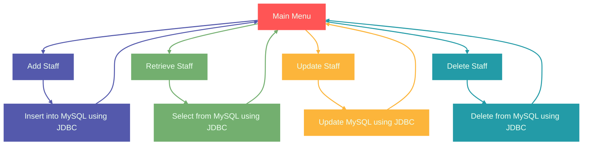

# 🏫 Teaching Staff Management System

A **console-based Java application** for managing teaching staff records in a MySQL database.  
This system provides CRUD (Create, Read, Update, Delete) operations with a clean **menu-driven interface**.

---

## 🌟 Features

| Feature | Description |
|---------|-------------|
| **Add Staff** | Add a new teaching staff with Name, Email, Phone, City, State, Department, and Salary. |
| **Retrieve Staff** | Retrieve individual staff by ID or list all staff in a table format. |
| **Update Staff** | Update staff’s Email, Phone, or Salary. |
| **Delete Staff** | Remove staff by ID safely. |
| **User-friendly Console** | Simple menu with input validation and clear messages. |
| **Database Connectivity** | JDBC connection to MySQL for persistent data storage. |

---

## 🛠 Technologies Used

- **Java (JDK 8+)**
- **MySQL**
- **JDBC (Java Database Connectivity)**
- **Console-based UI**

---

## 🗄 Database Setup

1. **Create Database** (example: `test`) in MySQL:

```sql
CREATE DATABASE test;
USE test;
```
2. **Create Table** `techstaff` :

```SQL
CREATE TABLE techstaff (
    tid INT AUTO_INCREMENT PRIMARY KEY,
    tsName VARCHAR(50) NOT NULL,
    tsEmail VARCHAR(50) NOT NULL,
    tsPhone BIGINT NOT NULL,
    tsCity VARCHAR(50),
    tsState VARCHAR(50),
    tsDept VARCHAR(50),
    tsSalary INT
);
```

3. **Update Database Credentials** in `DbConnection.java` :
```java
String url = "jdbc:mysql://localhost:3306/test";
String user = "root";
String pswd = ""; // Replace with your MySQL password

```

---

## 💡 Usage Example

**Menu Example :**

```
=================== Teaching Staff Manage ===================
1 : Add Staff
2 : Retrieve Staff
3 : Update Staff
4 : Delete Staff
5 : Exit
Please enter your choice :: 
```

**Retrieve Staff Output (All Records):**
```
------------------------------------------------- All TechStaff -----------------------------------------------------
ID    Name                 Email                    Phone        City           State          Dept           Salary
---------------------------------------------------------------------------------------------------------------------
1     Amit Kumar           amit@example.com         9876543210   Mumbai         Maharashtra    CSE            50000
2     Neha Sharma          neha@example.com         9123456780   Pune           Maharashtra    IT             48000

```

---

## 📌 Works Flow



### files

| File Name          | Description                                                      |
|-------------------|------------------------------------------------------------------|
| **DbConnection.java** | Establishes connection with MySQL using JDBC.                  |
| **AddStaff.java**     | Inserts a new staff record into the database.                  |
| **RetrieveStaff.java**| Fetches individual or all staff details from the database.     |
| **UpdateStaff.java**  | Updates Email, Phone, or Salary for a given staff ID.          |
| **RemoveStaff.java**  | Deletes a staff record by ID from the database.                |
| **Main.java**         | Provides a user-friendly menu to access all functionalities.   |

---

## ⚡ Insights

- Safe database operations using PreparedStatement to prevent `SQL injection`.
- Resource management with try-with-resources ensures `Connection`, `PreparedStatement`, and `ResultSet` are closed automatically.
- Input validation prevents runtime errors for `invalid inputs`.
- Extensible design: Can easily add more fields or features like search by department or sorting by salary.